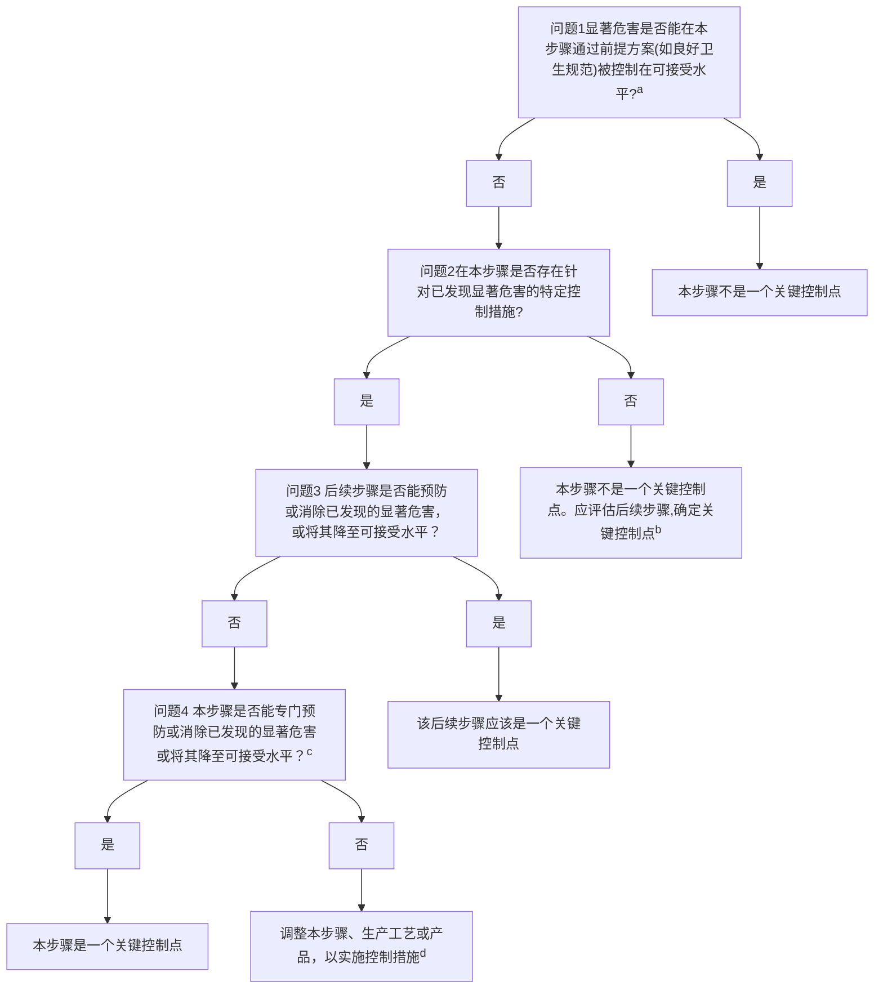

|项目 |信息 |
|---|---|
|标准号 |GB 14881 |
|年代号 |2025 |
|名称 |食品安全国家标准 预包装食品营养标签通则 |
|发布部门 |中华人民共和国国家卫生健康委 |
|文号 |2025年  第6号 |
|发布日期 |2025-09-02 |
|实施日期 |2026-09-02 |
|文件类型 |食品安全国家标准 |

# 前言

本标准代替GB14881—2013《食品安全国家标准 食品生产通用卫生规范》。

本标准与被代替标准相比，主要变化如下：

——修改了术语和定义；\
——修改了选址和厂区环境要求；\
——修改了厂房和车间要求；\
——修改了设施与设备要求；\
——修改了卫生管理要求；\
——修改了食品原料、食品添加剂和食品相关产品要求；\
——修改了生产过程的食品安全控制要求；\
——修改了检验要求；\
——修改了食品的贮存和运输要求；\
——修改了产品召回及追溯管理要求；\
——修改了培训要求；\
——删除了“管理制度和人员”章节，有关要求调整到各相关章节；\
——修改了记录和文件管理要求；\
——修改了附录“食品生产过程的微生物监控程序指南”；\
——增加了附录“HACCP原理及其应用指南”。

# 1 范围

本标准规定了食品生产企业的选址及厂区环境、厂房和车间、设施与设备、卫生管理以及食品原料、食品添加剂和食品相关产品的管理、生产过程的食品安全控制、检验、食品的贮存和运输、食品召回及追溯管理、人员培训、记录和文件管理等的基本要求和管理准则。

本标准适用于各类食品的生产。食品生产专项卫生规范的制定应以本标准作为基础。

# 2 术语和定义

# 2.1 污染

食品生产过程中带入或产生的生物性、化学性、物理性等有害物质的过程。

## 2.2 虫害

对食品生产和产品造成不良影响的昆虫(如苍蝇、蟑螂、谷螟等)、鸟类(如麻雀等)、啮齿类(如老鼠等)等动物。

## 2.3 食品生产人员

食品生产过程中直接接触包装或未包装的食品、食品设备和器具、食品接触表面的操作人员。

## 2.4 食品接触表面

食品生产过程中可能接触到食品的设备、工器具以及食品生产人员的皮肤、工作服等。

## 2.5 分离

通过在物品、设施、区域之间留有一定空间，而非通过设置物理阻断的方式进行隔离。

## 2.6 分隔

通过设置物理阻断如墙壁、卫生屏障、遮罩或独立房间等进行隔离。

## 2.7 食品生产场所

用于食品生产的建筑物和场地，以及按照相同方式管理的其他建筑物、场地和周围环境等。

## 2.8 监控

按照预设的方式和参数进行观察或测定，以评估控制环节是否处于受控状态。

## 2.9 工作服

为降低食品生产人员对食品的污染风险而配备的专用服装及配套物品，如衣、裤、鞋靴、帽子、发网、口罩、围裙、套袖、手套等。

## 2.10 清洁作业区

通过采取控制措施以满足食品生产过程较清洁程度要求的食品生产作业区域。

## 2.11 一般作业区

对于食品生产过程清洁程度无特殊要求的食品生产作业区域。

## 2.12 准清洁作业区

生产过程中根据食品加工工艺需要确定的清洁程度要求介于清洁作业区和一般作业区之间的食品生产作业区域。

## 2.13 接触食品用水

食品生产过程中与食品直接接触的用水，如与食品直接接触的清洗、冷却、解冻、制冰和蒸汽用水，食品接触表面的清洁用水等。

## 2.14 非接触食品用水

食品生产过程中不直接与食品接触的用水，如夹套保温水、间接冷却水、非食品接触表面的清洁用水等。

# 3 选址及厂区环境

## 3.1 选址

3.1.1 厂区不应选择对食品有显著污染的区域。如某地对食品安全和食品宜食用性存在明显的不利影响，且无法通过采取措施加以改善，应避免在该地址建厂。

3.1.2 厂区不应选择有毒、有害物质以及粉尘、有害气体、放射性物质和其他扩散性污染源不能有效清除的地址。

3.1.3 厂区不应选择在易发生洪涝灾害的地区，难以避开时应有必要的防范措施。

3.1.4厂区周围不应有存在虫害大量孳生潜在风险的场所，难以避开时应有必要的防范或消除措施。

## 3.2 厂区环境

3.2.1 应考虑环境给食品生产带来的潜在污染风险，并采取适当的措施将其降至最低水平。

3.2.2 厂区应合理布局，各功能区域划分明显，并有适当的分离或分隔措施，满足生产需要，防止交叉污染。

3.2.3 厂区内的道路应铺设混凝土、沥青或其他不易产生扬尘的硬质材料；空地应采取必要措施，确保在正常天气下能够防止扬尘和积水的产生，保持环境清洁。

3.2.4 厂区绿化应与食品生产车间保持适当距离，植被应定期维护，防止虫害孳生。植被种类、农药及肥料品种及其施用方式应防止污染生产区域。

3.2.5 食品生产场所内不应饲养与生产无关的动物。

3.2.6 厂区应有适当的排水系统，并根据需要采取适当措施防止污水倒流和地面积水。

3.2.7 宿舍、食堂、职工娱乐设施等生活区应与食品生产区域保持适当距离或分隔。

3.2.8 厂区内污水处理设施及燃煤锅炉房等易产生粉尘的场所应与食品生产场所保持适当距离，并位于主风向的下风向，难以避开时应采取必要的防范措施。

3.2.9 厂区内建筑施工和整修期间应采取分隔等适当措施避免对食品生产区域产生影响。难以分隔时应有必要的防范措施。

# 4 厂房和车间

## 4.1 设计和布局

4.1.1 厂房和车间应根据生产工艺需要合理设计和布局，满足食品安全有关操作要求，避免食品生产中发生污染。

4.1.2 厂房和车间应根据产品特点、生产工艺、生产特性以及生产过程对清洁程度的要求合理划分作业区，并采取有效措施分离或分隔。作业区通常可划分为清洁作业区、准清洁作业区和一般作业区；或清洁作业区和一般作业区等。一般作业区应与其他作业区分隔。不同清洁程度作业区应分别设置工器具清洁消毒区域。

4.1.3 厂房的面积和空间应与生产能力相适应，便于设备安置、清洁消毒、物料存储及人员操作。厂房内设备、管道布置应便于操作、维修和清洁。

4.1.4 检验室应与生产区域有效分隔。如需在生产区域实施现场检验，应根据车间环境控制要求合理设置，不应引起污染。

## 4.2 建筑内部结构与材料

### 4.2.1 内部结构

建筑内部结构应不易脱落，易于维护、清洁和消毒。应采用适当的耐用材料建造。

### 4.2.2 顶棚

4.2.2.1 顶棚应使用无毒、无味、与生产需求相适应、易于观察清洁状况的材料建造；若直接在屋顶内层喷涂涂料作为顶棚，应使用无毒、无味、防霉、不易脱落、易于清洁的涂料。

4.2.2.2 顶棚应易于清洁消毒，在结构上防止产生的冷凝水滴下或设置避免冷凝水滴下的装置，以防霉菌生长和虫害孳生，必要时可采取通风、除湿、降低温差等措施避免冷凝水产生。

4.2.2.3 水和/或汽、电、气等各种管路管线应避免设置于裸露食品的上方；如确需设置，应防止其表面脱落、积尘、积水，或有能防止表面脱落、粉尘散落及水滴掉落的装置或措施。

### 4.2.3 墙壁

4.2.3.1 墙面、隔断应使用无毒、无味的防渗透材料建造，在操作高度范围内的墙面应平整光滑、不易积累污垢且易于清洁；若使用涂料，应无毒、无味、防霉、不易脱落、易于清洁。

4.2.3.2 墙壁、隔断和地面交界处应结构合理、易于清洁，如设置弧形交界面等，有效避免污垢积存。食品生产工艺对生产场地、墙壁有特殊要求的，应符合其生产工艺要求。

4.2.3.3 与外界相通的穿墙管道四周不应留有孔洞和缝隙，防止虫害侵入。

### 4.2.4 门窗

4.2.4.1 门窗应闭合严密，应使用不透水、坚固、不变形的材料制成，并易于清洁、消毒。

4.2.4.2 门窗玻璃应使用不易碎材质。若必须使用普通玻璃，应采取必要的措施防止玻璃破碎后对原料、包装材料及食品造成污染。

4.2.4.3 宜避免设置窗台，如需设置，其结构应能避免灰尘积存且易于清洁。可开启的窗户应装有易于清洁且有效防虫害的窗纱或其他密封设施。

4.2.4.4 门的表面应平滑、防吸附、不渗透。清洁作业区和准清洁作业区与其他区域之间的门应能及时有效关闭。物料传递口应采取有效措施避免交叉污染。

4.2.4.5 应急逃生门以外的与外界相通的，以及非全封闭的加工过程的生产车间门口应安装防蝇帘或风幕机或采取其他有效措施防止蝇虫进入。使用防蝇帘的，防蝇帘应覆盖整个门框。使用风幕机的，风幕应完整覆盖出入通道。

4.2.4.6 生产车间设有与外界相通的物料传递口的，应符合4.2.4.5的要求。

### 4.2.5 地面

4.2.5.1 地面应使用无毒、无味、不渗透、耐腐蚀的材料建造。地面结构应有利于排污和清洗。

4.2.5.2 地面应平坦防滑、无明显裂缝，易于清洁、消毒，并有适当的措施防止积水。

# 5 设施与设备

## 5.1 设施

### 5.1.1 供水设施

5.1.1.1 应能保证水质、水压、水量及其他供水要求符合生产需要。

5.1.1.2 食品生产过程中接触食品用水、非接触食品用水等应以完全分离的管路输送，各管路系统应明确标识以便区分。

5.1.1.3 接触食品用水的水质应符合GB5749的规定。对水质有特殊要求的，应配备适宜的水处理设备或设施，或采取相应措施以符合相关规定。

5.1.1.4 接触食品用水的输水管道、储水设施所用材料应无毒、耐腐蚀，符合相关规定。

5.1.1.5 自备水源及供水设施应符合有关规定。供水设施中使用的涉及饮用水卫生安全的产品还应符合国家相关规定。

### 5.1.2 排水设施

5.1.2.1 排水系统的设计和建造应做到排水畅通，便于清洁维护，保证食品不受污染。

5.1.2.2 排水系统入口应安装带水封的或其他封闭式地漏等装置，以防止浊气逸出。应定期检查地漏封闭性能的有效性，带水封的地漏避免水封干涸。必要时应设置固体废弃物收集装置，防止固体废弃物进入管道。

5.1.2.3 排水系统出口应有适当措施以防止虫害侵入。

5.1.2.4室内排水的流向应由清洁程度要求高的区域流向清洁程度要求低的区域，且应有防止逆流的措施。

### 5.1.3 清洁消毒设施

5.1.3.1 应配备足够的食品、工器具和设备的专用清洁设施，必要时应配备适宜的消毒设施。应设置专用的区域放置清洁剂、消毒剂和消毒工器具等设施，避免交叉污染。

5.1.3.2 可移动设备或可拆卸器具的清洁消毒应避免交叉污染，必要时应设置专门区域或清洁消毒室。

### 5.1.4 废弃物存放设施

5.1.4.1 应配备设计合理、防止渗漏、易于清洁的存放废弃物的专用设施和容器，必要时使用密闭设施和容器。

5.1.4.2 车间内存放废弃物的设施和容器应标识清晰，并分类存放。

5.1.4.3 必要时应在适当地点设置废弃物临时存放设施和容器，并依废弃物特性分类存放。

### 5.1.5 个人卫生设施

5.1.5.1 生产场所或生产车间入口处应设置更衣室，其空间大小和更衣设施的数量应与各班次食品生产人员数量相适应；必要时，应根据产品工艺特点、作业区清洁程度要求等在特定的作业区入口处按需要设置独立的更衣室。更衣室应保证工作服与个人服装及其他物品分开放置。

5.1.5.2 生产车间入口及车间内必要处，应根据生产清洁程度要求设置换鞋(穿戴鞋套)设施或工作鞋靴消毒设施，换鞋设施应保证工作鞋与个人用鞋分开放置。如设置工作鞋靴消毒设施，其规格尺寸应能满足消毒需要。

5.1.5.3 应根据需要设置卫生间。卫生间的结构、设施与内部材质应易于清洁，卫生间内的适当位置应设置洗手设施。卫生间不得与食品生产区域直接连通，防止交叉污染。

5.1.5.4 应根据产品特点、生产工艺、生产特性等在清洁作业区入口设置洗手、干手、消毒设施。如有需要，应在作业区内适当位置加设洗手和/或消毒设施。

5.1.5.5 洗手、消毒设施配套的水龙头数量应满足同班次食品生产人员使用，其开关应为非手动式，必要时应设置冷热水混合器。洗手池应采用光滑、不透水、易清洁的材质制成，其设计及构造应易于清洁消毒。应配备洗手液等清洁产品，并在临近洗手设施的显著位置标示简明易懂的洗手方法。

5.1.5.6 根据生产清洁程度的要求，必要时应设置风淋室或淋浴室等设施。

### 5.1.6 通风设施

5.1.6.1 应具有适宜的通风措施；必要时应通过自然通风或机械设施有效控制生产环境的温度和湿度。通风时应避免车间内空气从清洁程度要求低的作业区流向清洁程度要求高的作业区。

5.1.6.2 应合理设置进气口位置，进气口与排气口和户外垃圾存放装置等污染源保持适宜的距离和角度。进、排气口应装有防止虫害侵入的网罩等设施。通风排气设施应便于清洁、维修或更换。

5.1.6.3 若生产过程需要对空气进行过滤净化处理，应加装空气过滤装置并定期清洁维护。

5.1.6.4 应根据生产需要，对容易产生粉尘的生产区域安装除尘设施并定期清洁，对容易产生大量蒸汽、油烟或异味的生产区域设置有效的机械排风设备。

5.1.6.5 可能产生污染的检验室应采用独立的通风设施。

### 5.1.7 照明设施

5.1.7.1 厂房内应有充足的自然采光或人工照明，照度应能满足生产、操作和检验需要；光源应使食品呈现真实的颜色。

5.1.7.2 如需在裸露食品的上方安装照明设施，应使用安全型照明设施或采取防护措施。

### 5.1.8 仓储设施

5.1.8.1 应具有与所生产产品的数量、贮存要求、容器周转期及产品检验周期等相适应的仓储设施。

5.1.8.2 仓库应以无毒、坚固的材料建成。仓库地面应平整(智能仓储轨道除外),便于通风换气。仓库的设计应能易于维护和清洁,并应有防止虫害侵入的装置。

5.1.8.3 仓库应根据需要配备适宜的照明设施，必要时应有温、湿度控制及监测设施和通风设施。

5.1.8.4 原料、半成品、成品、包装材料、食品添加剂等应依据性质的不同分设贮存场所或分区域码放，并有明确标识。如采用信息化仓储管理手段，应通过在系统中标识等手段建立针对性的有效控制措施。防止交叉污染或误用。

5.1.8.5 贮存物品应与墙壁、地面及顶棚保持适当距离，以利于空气流通、物品搬运、日常清洁等。

5.1.8.6 清洁剂、消毒剂、杀虫剂、润滑剂、燃料等物质应分别安全贮存，明确标识，并应与原料、食品添加剂、半成品、成品、包装材料等分隔放置。

5.1.8.7 临时贮存设施也应符合上述要求。

### 5.1.9 温湿度控制设施

5.1.9.1 应根据食品生产工艺和原料、半成品、成品、食品添加剂、包装材料贮存的要求，配备温度和/或湿度控制设施，如加热、除湿、冷却、冷冻等设施。

5.1.9.2 应根据监控生产车间、仓库、留样区域、实验室的温度和/或湿度的需要，配备用于监测温度和/或湿度的设施，必要时配备报警装置。

## 5.2 设备

### 5.2.1 生产设备

#### 5.2.1.1 一般要求

5.2.1.1.1 应配备与生产规模相适应的生产设备，并按工艺流程合理布局，避免引起交叉污染。移动式设备使用结束后应妥善保存。

5.2.1.1.2 与设备连接的主要固定管道，应标明管内物料名称及流向，并定期检查，防止损坏、泄漏。当管路上设有防混阀或转换板等时，应定期检查，防止泄漏，避免污染。

5.2.1.1.3 应建立设备保养和维修制度，加强设备的日常维护和保养，定期检修，及时记录。

#### 5.2.1.2 材质

5.2.1.2.1 与原料、半成品、成品、食品添加剂接触的设备与工器具，应使用无毒、无味、耐腐蚀、非吸收性、不易脱落的材料制作，其材质应符合食品相关产品的有关要求，在正常生产条件下不会与食品、食品添加剂、清洁剂和消毒剂发生反应。

5.2.1.2.2 设备、工器具等与食品接触表面应光滑、易于清洁保养和消毒，并应保持完好无损。

#### 5.2.1.3 设计

5.2.1.3.1 所有生产设备应从设计和结构上避免零件、金属碎屑、润滑油或其他污染因素混入食品，并应易于清洁消毒、检查和维护。与食品直接接触的衔接部位应严密、牢固、平整光滑，尽量减少缝隙。

5.2.1.3.2 设备应不留空隙地稳固固定在墙壁或地板上，或在安装时与地面和墙壁间保留足够空间，以便清洁和维护。

5.2.1.3.3 高架步道应避免紧邻或跨过裸露食品生产线，并易于清洁和维护。如无法避免，应采取有效措施防止其对产品和生产线造成污染。

5.2.1.3.4 对于粉尘多的设备，应考虑采取有效措施除尘。

### 5.2.2 监控设备

5.2.2.1 应根据生产场所环境监控、生产线在线监控等需要，配备相应监控设备和设施。

5.2.2.2 用于监测、控制、记录的设备，如压力表、温度计、记录仪等，应定期检定或校准、维护。鼓励采用自动记录装置记录监控参数。

# 6 卫生管理

## 6.1 一般要求

6.1.1 应开展生产过程的危害分析，明确关键控制点并建立相应的食品安全控制措施。

6.1.2 鼓励基于危害分析与关键控制点(HACCP)原理建立相应的食品安全管理体系。

6.1.3 危害分析与关键控制点(HACCP)原理及其应用可参考附录A。

## 6.2 管理制度

6.2.1 应制定与食品种类、生产工艺和生产规模相适应的食品安全管理制度，并根据生产实际和实施情况不断完善。

6.2.2 食品安全管理制度应至少包括食品安全关键环节监控、卫生标准操作程序、清洁消毒、食品生产人员健康、食品安全自查、食品安全管理人员及专业技术人员要求，食品原料、食品添加剂和食品相关产品的采购、验收、运输和贮存要求，以及食品添加剂使用、生产过程中防止污染、产品召回、人员培训、记录和文件管理要求等。

6.2.3 应对管理制度的执行情况开展检查，必要时采取纠正措施。

## 6.3 厂房及设施管理

6.3.1 厂房内各项设施应保持清洁，出现问题及时维修或更新。开展日常维护和保养，定期检修，及时记录。

6.3.2 生产、包装、贮存等设备及工器具、生产用管道、裸露食品接触表面等应定期清洁，根据需要定期消毒。

6.3.3 已清洗和消毒过的可移动或可拆卸的设备和器具，应放在能防止其食品接触表面再受污染的适当场所，并保持适用状态。

6.3.4 更衣室、风淋室和卫生间等应定期清洁消毒，保证卫生。

## 6.4 人员管理

### 6.4.1 食品生产人员健康管理

6.4.1.1 从事接触直接入口食品工作的食品生产人员应每年进行健康检查，取得健康证明后方可上岗工作。

6.4.1.2 患有霍乱、细菌性和阿米巴性痢疾、伤寒和副伤寒、病毒性肝炎(甲型、戊型)、活动性肺结核、化脓性或者渗出性皮肤病等国家卫生健康行政部门规定的有碍食品安全疾病的人员,不得从事接触直接入口食品的工作。

6.4.1.3 食品生产人员每天上岗前应检查健康状况，有发热、呕吐、腹泻等症状及化脓性或渗出性皮肤病的，应暂停从事接触直接入口食品的工作，待查明原因排除有碍食品安全的疾病并做好必要的防护后方可重新上岗。

### 6.4.2 食品生产人员卫生要求

6.4.2.1 进入食品生产场所前应整理个人卫生，防止污染食品。

6.4.2.2 进入作业区应规范穿着与生产区域清洁程度要求相匹配的洁净工作服，并按要求更鞋、更衣、洗手或消毒。头发应藏于工作帽内或使用发网约束。

6.4.2.3 进入作业区不应佩戴、携带、存放或使用与食品生产无关的个人用品，如饰物、手表等。不应化妆、染指甲、喷洒香水。

6.4.2.4 作业区内不应有可能影响食品安全的行为。使用卫生间、接触可能污染食品的物品、或从事与食品生产无关的其他活动后，再次从事接触食品、工器具、设备等与食品生产相关的活动前应使用流水洗手，并按要求消毒。

### 6.4.3 非食品生产人员管理

非食品生产人员不得进入食品生产作业区，特殊情况下进入时应遵守和食品生产人员同样的卫生要求。

## 6.5 虫害控制

6.5.1 应保持建筑物完好、环境整洁，防止虫害侵入及孳生。\
6.5.2 应制定和执行虫害控制措施，并定期检查。生产车间及仓库应采取有效措施（如纱帘、纱网、挡鼠板、灭蝇灯、风幕等），防止虫害侵入。若发现有侵入痕迹时，应追查来源，消除隐患。

6.5.3 应准确绘制虫害控制平面图，标明虫害控制措施（如捕鼠器、粘鼠板、灭蝇灯、室外诱饵投放点、生化信息素捕杀装置等）的位置。

6.5.4 厂区应定期进行除虫灭害工作，并记录。虫害消杀作业结束后，应及时清理虫害尸体、消杀用具和药剂等。

6.5.5 采用物理、化学或生物制剂控制虫害时，不应影响食品安全和食品应有的品质、不应污染食品接触表面、设备、工器具及包装材料。

6.5.6 使用各类杀虫剂或其他药剂前，应做好预防措施避免对人身、食品、设备工具造成污染。如不慎污染，应及时处理，彻底清洁，消除污染。

6.5.7 杀虫剂或其他药剂的贮存、领用和配制应有相关记录，并有专人复核。如虫害消杀由有资质的专业服务商进行，应保留相应记录（如使用药剂种类、使用数量、浓度、施药地点、时间、方法、目标虫害等），确保服务商带入和带出的药剂可追溯。

## 6.6 废弃物处理

6.6.1 应制定废弃物存放和清除制度，明确不同废弃物的存放方式和清除要求。车间内废弃物应及时清理，清理过程防止交叉污染；易腐败的废弃物应尽快清除，必要时一物一清；有特殊要求的废弃物，其处理方式应符合有关规定。

6.6.2 车间外废弃物放置场所及处理设施设备应与食品生产场所有效分离或分隔，防止污染。

6.6.3 废弃物存放设备及场所应定期清洗，必要时消毒，防止不良气味或有害有毒气体溢出，以及有害生物孳生。

## 6.7 工作服管理

6.7.1 应根据食品的特点及生产工艺的要求配备专用工作服。清洁作业区的工作服宜在款式、颜色或标志物等方面进行明显区分。不同作业区的工作服应在规定的区域中使用，不应混用。

6.7.2 应制定工作服的清洗保洁制度，必要时应及时更换。可根据需要设置工作服清洗间。应有保证已清洗的工作服不被污染的措施。生产中应注意保持工作服干净完好。

6.7.3 工作服设计、选材和制作应满足不同作业区的要求，降低交叉污染食品的风险。宜选择防静电吸附的材料。应合理选择工作服口袋的位置、使用的连接扣件等，降低内容物或扣件掉落污染食品的风险。

# 7 食品原料、食品添加剂和食品相关产品管理

## 7.1 一般要求

7.1.1 应确保所使用的食品原料、食品添加剂和食品相关产品符合国家有关要求，验收合格后方可使用。

7.1.2 所使用的食品原料、食品添加剂和食品相关产品应符合相关食品安全标准以及国家有关规定。禁止使用非食品原料生产食品、在食品中添加食品添加剂以外的化学物质及其他可能危害人体健康的物质，或使用回收食品作为原料生产食品。

7.1.3 鼓励开展供应商评估，建立供应商档案，确保所采购的食品原料、食品添加剂和食品相关产品安全。

7.1.4 食品原料、食品添加剂和食品包装材料等进入生产区域时应对外包装采取清洁措施或有一定的缓冲区域清除外包装，必要时可设置货淋间。

## 7.2 食品原料

7.2.1 采购的食品原料应查验供货者的资质及产品合格证明文件，食用农产品的查验按国家有关规定执行。进口原料应查验国家有关部门出具的入境货物证明等相关文件；从国内采购进口原料的，还应查验供货者资质。

7.2.2 经验收不合格的食品原料(标签标识不符合且可以现场采取补救措施的除外)，应与合格品分离或分隔放置并明显标记，或采取系统管理等控制措施避免误用，并应及时进行退、换货等处理。

7.2.3 加工前应进行感官检查，必要时进行实验室检验。发现腐败变质、霉变以及食品安全项目指标异常的，不得使用。

7.2.4 根据验收要求经开封取样后的食品原料、生产过程开封后未使用完毕退库或暂存的食品原料，应建立有效的管控措施避免交叉污染并保障其适用性。

7.2.5 对需多道工序清洗的初级原料，根据生产需要可将后道工序清洗用水用于前道工序清洗，并保证不因此给产品带来食品安全风险。

## 7.3 食品添加剂

7.3.1 采购食品添加剂应查验供货者的资质及产品合格证明文件。进口食品添加剂应查验国家有关部门出具的入境货物证明等相关文件；从国内采购进口食品添加剂的，还应查验供货者资质。

7.3.2 食品添加剂应按标示的贮存条件贮存，并应专库或专区存放，采用专用登记册（或仓库管理软件)记录进货和使用情况。

7.3.3 根据验收要求经开封取样后的食品添加剂、生产过程开封后未使用完毕退库或暂存的食品添加剂，应建立有效的管控措施避免交叉污染并保障其适用性。

## 7.4 食品相关产品

7.4.1 采购食品相关产品应查验产品的合格证明文件，实行许可管理的食品相关产品还应查验供货者的许可证。进口食品相关产品应查验国家有关部门出具的入境货物证明等相关文件；从国内采购进口食品相关产品的，还应查验供货者资质。

7.4.2 食品相关产品应能在正常的贮存、运输、销售条件下最大限度地保障食品的安全性和食品品质不受外界影响。

7.4.3 使用食品相关产品前应核对标识，避免误用。如实记录食品相关产品的使用情况。

## 7.5 其他

7.5.1 用于食品、内包装、清洁食品直接接触表面或设备的压缩空气或其他气体，应根据气体来源、产品特性和工艺要求采取如除油、除水、除尘等净化处理，必要时除菌过滤，以防止污染。

# 8 生产过程的食品安全控制

## 8.1 生物性污染的控制

### 8.1.1 清洁和消毒

8.1.1.1 应根据原料、产品和工艺的特点，针对生产设备和环境制定有效的清洁消毒制度，降低微生物污染和交叉污染的风险。

8.1.1.2 清洁消毒制度应包括以下内容：清洁消毒的区域、设备或工器具名称；清洁消毒工作的职责；使用的洗涤、消毒剂；清洁消毒方法和频率；清洁消毒效果的验证及不符合项的处理；清洁消毒工作及监控记录。

8.1.1.3 应确保清洁消毒制度的有效实施，及时验证清洁消毒效果，发现问题及时纠正，并如实记录。

### 8.1.2 微生物监控

8.1.2.1 根据生产工艺和产品特点确定关键控制环节进行微生物监控，防止微生物生长繁殖及产生毒素的风险；必要时应建立食品生产过程的微生物监控程序，包括生产环境的微生物监控和过程产品的微生物监控。

8.1.2.2 食品生产过程的微生物监控程序应包括：微生物监控指标、取样点、监控频率、取样和检测方法、评判原则和整改措施等。具体可参考附录B的要求，结合生产工艺及产品特点制定。

8.1.2.3 微生物监控以指示性微生物监控为主，必要时进行致病性微生物监控。食品生产过程的微生物监控结果应能反映食品生产过程中对微生物污染的控制水平。

### 8.1.3 寄生虫控制

对可能存在寄生虫污染风险的食品，应确保相应的控制措施能发现和杀灭寄生虫及其虫卵。

## 8.2 化学性污染的控制

8.2.1 应分析可能的污染源和污染途径，制定适当的控制计划和控制程序。

8.2.2 应按照相关法律法规和GB2760的要求使用食品添加剂。

8.2.3 生产设备上可能直接或间接接触食品的活动部件若需润滑，应使用能保证食品安全的润滑油脂，并采取措施防止油污造成污染，必要时清洁消毒。

8.2.4 建立清洁剂、消毒剂等化学品的使用制度。使用的清洁剂、消毒剂应符合相应的食品安全标准。除清洁消毒必需和工艺需要，不应在生产场所使用和存放可能污染食品的化学制剂。

8.2.5 食品添加剂、清洁剂、消毒剂等均应做好领用及使用记录。

8.2.6 应当采取有效措施控制生产过程中可能产生的有害物质。

## 8.3 物理性污染的控制

8.3.1 应分析可能的污染源和污染途径，并制定相应的控制计划和控制程序。

8.3.2 应通过采取设备维护、食品安全管理、现场管理、外来人员管理及加工过程监督等措施，最大程度地降低食品受到玻璃、金属、塑胶等异物污染的风险。

8.3.3 应采取有效措施降低金属或其他异物污染食品的风险，如设置筛网、捕集器、磁铁、金属检查器、X光机等。

8.3.4 当进行现场维修、维护及施工等工作时，应采取适当措施避免异物、异味、碎屑等污染食品。设备工具、拆卸后的设备部件等应妥善放置；被维修设备周边未处于停产状态时，应对被维修设备采用适当的措施进行防护；维修完成后，应及时清洁相关区域。

## 8.4 致敏物质的管理

8.4.1 应对食品生产人员和食品安全管理人员开展致敏物质管理知识的相关培训。

8.4.2 鼓励建立致敏物质管理制度。宜在评估食品配方、原料、生产工艺和流程的基础上分析识别食品中的致敏物质，准确完整地记录与致敏物质管理的相关内容。应避免不含致敏物质的产品与含致敏物质的产品，以及含不同致敏物质的产品共线生产，难以避免时应采取清洁措施。

8.4.3 鼓励通过产品研发、设备设计、食品安全管理、工器具管理、生产管理、生产过程标识管理及贮存运输管理等措施，减少食品受到致敏物质交叉污染的风险。

8.4.4 妥善贮存和使用含致敏物质的原料、半成品和成品，避免交叉污染。

## 8.5 包装过程的管理

8.5.1 应避免外包装材料直接暴露于裸露半成品、裸露成品的同一空间内，如无法避免，应采取如对外包装材料清洁、消毒等有效措施防止污染。

8.5.2 内包装应确保达到生产要求的包裹及封口效果。真空包装、充气包装应达到相应要求（如真空度、充气量、充气压力等），并监测其密封性。

# 9 检验

9.1 应进行食品出厂检验，通过自行检验或委托具备相应资质的食品检验机构对产品进行检验并记录。

9.2 自行检验应具备与所检项目适应的检验室、检验设备和检验能力；由具有相应检验能力的人员按规定的检验方法检验；检验仪器设备应按相关规定定期检定或校准。

9.3 检验室内的检验设施和环境条件应适合实验活动，防止检验交叉污染以及分析仪器之间、人员之间相互干扰。

9.4 检验室应有完善的管理制度，应完整保存各项检验的原始记录和检验报告。

9.5 应建立产品留样制度，及时按要求保留样品。

9.6 应综合考虑产品特性、工艺特点、原料控制情况等因素合理确定检验项目和检验频次、检验取样点，以验证生产过程中的控制措施有效实施。容易受生产过程影响而变化的检验项目的检验频次应不少于其他检验项目，如净含量、感官要求等。

9.7 同一品种不同包装的产品，不受包装规格和包装形式影响的检验项目可以一并检验。

# 10 食品的贮存和运输

10.1 根据食品的特点和食品安全需要选择适宜的贮存和运输条件，必要时应配备保温、冷藏、保鲜等设施。不得将食品与有毒、有害、有异味的物品一同贮存运输。

10.2 应建立和执行适当的仓储制度，设专人管理。定期检查食品原料、食品添加剂、食品相关产品质量和食品安全情况，及时清理变质或超过保质期的物品。仓库出货顺序应遵循“先进先出”或“近保质期先出”的原则，必要时应根据不同食品原料、食品添加剂、食品相关产品的特性确定出货顺序，发现异常应及时处理。

10.3 贮存、运输和装卸食品、食品添加剂、食品相关产品的容器、工器具和设备应当安全、无害，保持清洁，降低食品污染的风险。

10.4 贮存和运输过程中应避免日光直射、雨淋、显著的温湿度变化和剧烈撞击等，防止食品受到不良

影响。

10.5 委托贮存、运输食品的，应对受托方的食品安全保障能力进行审核，并监督受托方按照保证食品安全的要求贮存、运输食品。受托方应保证食品贮存、运输条件符合食品安全的要求，加强食品贮存、运输过程管理，应如实记录委托方和收货方的名称、地址、联系方式等内容。

# 11 食品召回及追溯管理

11.1 当发现生产的食品不符合食品安全标准或有证据证明可能危害人体健康时，应立即停止生产，按有关规定召回已经上市销售的食品，通知相关生产经营者和消费者，并记录召回和通知情况。

11.2 对被召回的食品，应进行显著标示或者单独存放在有明确标志的场所，及时采取无害化处理、销毁等措施并如实记录。对因标签、标识等不符合食品安全标准而被召回的食品，可在采取补救措施且能保证食品安全的情况下继续销售，销售时应明示补救措施。

11.3 食品生产者应根据国家有关规定建立食品安全追溯体系。应合理划分记录生产批次，可采用产品批号等方式进行标识，便于产品追溯。鼓励食品生产者采用信息化手段采集、留存生产信息，建立食品安全追溯体系。

# 12 人员培训

12.1 应确保食品安全专业技术人员以及食品生产人员相应的食品安全知识培训合格后上岗。

12.2 食品安全管理人员应了解食品安全法律法规、食品安全的基本原则和操作规范，能够判断潜在的食品安全风险，采取适当的预防和纠正措施，确保有效管理。经考核不具备食品安全管理能力的，不得上岗。

12.3 应通过培训促进各岗位人员遵守食品安全相关法律法规标准和执行各项食品安全管理制度的意识和责任，提高相应的知识水平。

12.4 应根据食品生产不同岗位的实际需求，制定和实施食品安全年度培训计划并进行考核，做好培训及考核记录。

12.5 应定期审核和修订培训计划，评估培训效果，并进行常规检查，以确保培训计划的有效实施。

# 13 记录和文件管理

##13.1 记录管理

13.1.1 应对食品生产中采购、加工、贮存、检验、销售等环节详细记录。记录内容应完整、真实，确保对产品从原料采购到产品销售的所有环节都可进行有效追溯。
13.1.1.1 应如实记录食品原料、食品添加剂和食品相关产品的名称、规格、数量、供货者名称及联系方式、进货日期、生产日期或生产批号、检验和库存等内容，并保存相关凭证。上述内容依有关规定豁免的除外。
13.1.1.2 应如实记录食品的生产过程(包括工艺参数、环境监测、投料情况等)、产品贮存情况及产品的检验信息等内容。
13.1.1.3 应如实记录出厂产品的名称、规格、数量、生产日期或生产批号、检验合格证号、销售日期、购货者名称及联系方式等内容，并保存相关凭证。上述内容依有关规定豁免的除外。
13.1.1.4 应如实记录发生召回的食品名称、批次、规格、数量、发生召回的原因及后续整改方案等内容。

13.1.2 食品原料、食品添加剂和食品相关产品进货查验、食品出厂检验记录应由记录和审核人员复核签名，记录内容应完整。记录和凭证保存期限不得少于产品保质期满后六个月；没有明确保质期的，保存期限不得少于两年。

13.1.3 应建立客户投诉处理机制。对客户提出的书面或口头意见、投诉，应做记录并查找原因，妥善处理。

##13.2 应对文件进行有效管理，确保各相关场所使用的文件均为有效版本。

##13.3 鼓励采用信息化手段进行记录和文件管理，并定期备份。

##13.4 记录和文件应真实，不得篡改。

# 附录A（资料性） HACCP原理及其应用指南

注：本附录给出了危害分析及关键控制点(HACCP)原理及应用指南，实际生产中可根据产品特性和生产工艺等因素参照执行。

## A.1 术语和定义

### A.1.1 危害 hazard

食品中含有的可能对健康造成不良影响的生物、化学或物理因素。

### A.1.2 危害分析 hazard analysis

收集和评估原料及其他配料、环境、加工过程或食品中发现的危害，以及产生这些危害的信息，以确定其是否为显著危害的过程。

### A.1.3 显著危害 significant hazard

通过危害分析确定的某种危害，在缺乏控制的情况下极有可能达到不可接受的水平，必须对其进行控制才能确保食品能符合其预期用途。

### A.1.4 HACCP计划 HACCP plan

根据HACCP原理制定的、确保食品生产活动中的显著危害得以控制的文件。

### A.1.5 关键控制点 critical control point;CCP

采用一个或多个必要控制措施以控制某一显著危害的工序或步骤。

### A.1.6 关键限值 critical limit

与关键控制点采取的控制措施相关的可观察或可测量的判断标准，是区分食品可接受和不可接受的界限。

### A.1.7 前提方案 prerequisiteprogramme

为HACCP原理的实施提供了基本环境和操作条件要求的各项方案，包括良好卫生规范、良好生产规范以及诸如培训和可追溯性等其他规范和程序。

### A.1.8 可接受水平 acceptable level

食品在预期用途下被认为安全的食品中危害的最高允许水平。

### A.1.9 控制措施确认 validation of control measures

获取证据以证实某种控制措施或多种控制措施的组合在得到正确实施的情况下，能够控制某种危害，取得预期效果。

### A.1.10 偏离 deviation

不符合关键限值或未遵守良好卫生规范。

### A.1.11 纠正措施 corrective action

当发生偏离时所采取的措施，以重新建立控制、隔离受影响的产品(如果有)并确定如何处置，分析偏离产生的根源，预防或尽量减少偏离的再次发生。

### A.1.12 验证 verification

除监控外，通过采取各种方法、程序、测试和其他评估方式，确定某一控制措施是否在或一直在按预期运行。

## A.2 HACCP原理

HACCP 原理由以下七项原则组成。
原则1：实施危害分析并确定控制措施；
原则2：确定关键控制点；
原则3：建立关键控制点的关键限值；
原则4：建立关键控制点的监控系统；
原则5：建立纠正措施，以在关键控制点偏离关键限值时应用；
原则6：建立确认HACCP计划并建立验证程序，以证实HACCP原理的应用按预期运行；
原则7：建立并保持就上述原则及其应用相关的所有文件和记录。

## A.3 HACCP原理的应用步骤

### A.3.1 组建HACCP小组并确定范围（步骤1）

A.3.1.1 食品生产企业宜由具备生产、维护、质量控制、清洁和消毒等方面知识和技能的人员组建HACCP小组，负责制定HACCP计划。

A.3.1.2 若食品生产企业不完全覆盖相关方面技能，应从有关部门、行业协会、专家、相关文献和指南等渠道获得。当食品生产企业参考使用非本企业制定的HACCP计划时，应根据本企业实际情况进行调整。

A.3.1.3 HACCP小组应确定HACCP计划的范围和适用的前提方案。范围中应具体说明所包含的产品和工艺。

### A.3.2 描述产品（步骤2）

A.3.2.1 应对产品进行全面的描述并形成文件, 包括相关食品安全信息, 如原料组成、产品理化特性 (如水分活度、pH、防腐剂、致敏物质)、加工工艺(如热处理、冷冻、干燥、盐渍、熏制等)、包装、贮存条件、保质期和销售方式等。生产多种产品的企业在制定 HACCP 计划时, 可将具有相似产品特性和加工步骤的产品归为一组。

A.3.2.2 应考虑法规标准中已有的规定（如食品添加剂限量、微生物指标、农兽药最大允许残留量等）、热处理时间和温度要求等。

### A.3.3 明确预期用途和用户（步骤3）

应明确产品的预期用途和用户（包括其下游生产企业或消费者）。在特定情况下（如医院）需要关注易感人群（如病人）。如果食品是专门为特定人群生产的，应加强过程控制，并提高控制措施的监控频次，确保食品安全。

### A.3.4 绘制流程图（步骤4）

A.3.4.1 应绘制产品的工艺流程图。加工步骤相似的多个产品可以使用同一流程图。

A.3.4.2 流程图应列出食品生产所需的所有原料、食品添加剂和食品相关产品、水和气体。复杂的处理操作可以分成更小、更易于管理的子流程，明确子流程之间的相互关系。在开展危害分析时，应基于流程图对是否可能产生、增加、减少或引入危害进行评价。

A.3.4.3 流程图应清晰、准确且足够详细，以满足危害分析的需要。流程图应包括但不限于以下内容：

生产过程中各步骤顺序和相互作用；
原料、食品添加剂(含加工助剂)、包装材料、生产配套设施(如水和/或汽、电、气)和半成品进入流程的节点；
——企业外部的加工过程；
——返工点和循环点（适用时）；
——半成品的转序点、终产品的放行点以及废弃物和副产品的排放点。

### A.3.5 现场确认流程图（步骤5）

A.3.5.1 应在生产状态下对所有操作步骤进行现场核查，确认与所制定的流程图是否一致，必要时进行修改。

A.3.5.2 现场确认应由充分了解生产操作的人员进行。

### A.3.6 列出各步骤的潜在危害，进行危害分析，识别显著危害，并采取相应措施控制已识别的危害（步骤6/原则1）

### A.3.6.1 开展危害分析，包括识别潜在危害，并评估这些危害，确定哪些危害是显著的。

A.3.6.1.1 列出生产过程各步骤中的所有可能产生、引入、控制或增强的生物性、化学性、物理性潜在危害，描述其来源或存在的原因。危害分析工作表参见表 A.1。
A.3.6.1.2 对危害进行评估，确定哪些危害的预防、消除或降低到可接受水平对于生产安全食品是至关重要的（即确定必须在HACCP计划中解决的显著危害）。
A.3.6.1.3 确定哪些危害是显著危害时，不仅应考虑预期用途，也要考虑已知的非预期用途，并尽可能考虑以下因素：
与生产某类食品相关的危害, 包括与原料、食品添加剂、食品相关产品和加工步骤相关的危害 (例如从对食品链中危害的调查或采样和检测、召回、科学文献或流行病学数据中获得的信息);
——仅采用前提方案而不采用额外控制措施时，危害发生的可能性；
——如不采取控制措施，食品中的危害对健康造成不良影响的可能性和严重性；
——确定食品中危害的可接受水平，如基于法规、预期用途和科学信息；
——食品生产设备及器具的性能；
——致病性微生物的存活或繁殖情况；
——食品中的化学性危害(如农兽药残留、致敏物质、真菌毒素)或物理性危害(如玻璃、金属)的产生或存在；
——食品的预期用途和/或消费者对食品处理不当可能导致食品安全的可能性；
——导致上述情况的条件。

### A.3.6.2 制定并确认控制措施

A.3.6.2.1 应针对各显著危害制定相应的控制措施，并考虑一项控制措施控制多种显著危害或多项控制措施控制一种显著危害的情况。

A.3.6.2.2 应对控制措施进行确认，确保其能将相应的危害控制在可接受水平。

### A.3.7 确定关键控制点（步骤7/原则2）

A.3.7.1 应根据 A.3.6(步骤 6/原则 1) 中分析列出的显著危害与控制措施来考虑确定关键控制点。仅针对显著危害确定关键控制点。关键控制点应确定在必须控制的步骤上, 这些步骤一旦出现偏离可能导致生产出不安全的食品。

A.3.7.2 关键控制点的控制措施应能将危害控制至可接受水平。针对同一种危害可在一个以上的关键控制点进行控制，同一个关键控制点也可控制一种以上的危害。

A.3.7.3 可采用判断树方法或关键控制点工作表方法确定关键控制点，见图 A.1 和表 A.2。也可采用其他方法，如专家咨询。

A.3.7.4 确定关键控制点时，应考虑以下因素。
——评估控制措施能否用于正在分析的步骤。若无法使用, 则该步骤不应作为关键控制点; 若可在该步骤使用, 也可在后续步骤使用, 或者有其他控制措施在其他步骤可控制该危害, 则该步骤也不应作为关键控制点。
——确定某个步骤的某一控制措施是否需要与另一个步骤的某一控制措施组合使用以控制同一危害。若是, 则该两个步骤均应作为关键控制点。

A.3.7.5 确定的关键控制点可用表格形式总结，如表 A.2 的 HACCP 工作表；并在流程图的相应步骤中显著标记。

A.3.7.6 如果对某一已确定的显著危害在任何步骤上均不存在控制措施，则应对该产品或流程进行调整。

### A.3.8 建立关键控制点的关键限值（步骤8/原则3）

A.3.8.1 应为每个关键控制点的控制措施建立并科学确认关键限值。关键限值应可测量或可观察，能够区分可接受的和不可接受的产品。一旦发生偏离关键限值，则表明生产出的食品可能不安全。

A.3.8.2 某些情况下，一个关键控制点可以有一个或一个以上的关键限值（如热处理通常同时设有时间和温度两个关键限值）。常用的指标包括与控制措施相关的最小和/或最大值的关键参数，如温度、时间、湿度、 $\mathrm{pH}$ 、水分活度、有效氯、接触时间、输送带速度、黏度、电导率等。

A.3.8.3 可采取自行研究或委托研究确认关键限值，也可基于现有文献、法规或权威机构的指南及第三方开展的研究。

## A.3.9 建立关键控制点的监控系统（步骤9/原则4）

A.3.9.1 应开展关键控制点的监控，对照关键限值对关键控制点进行有计划的测量或观察。应对每个关键控制点制定并实施有效的监控措施，保证关键控制点处于受控状态。

A.3.9.2 监控程序应能确保发现关键控制点出现的偏离。监控方法和频率应取决于偏离的性质，并应能及时发现超出关键限值的情况，以及时对产品进行隔离和评价。如有可能，在监控结果表明某关键控制点有出现偏离的趋势时，应在偏离出现前进行调整。

A.3.9.3 一般情况下应对关键控制点实施连续监控。若采用非连续监控时，其监控频率应能保证关键控制点受控的需要。物理和化学测量通常优于微生物检测，因为通常其可以快速完成，并且可以指示与产品和/或过程相关的微生物危害的控制情况。

A.3.9.4 执行监控的人员应经过培训，了解在监控表明需要采取行动时应采取的适当步骤。监控数据应由具备相应知识的人员进行评价，并在必要时采取纠正措施。

### A.3.10 建立纠正措施（步骤10/原则5）

A.3.10.1 应对每个关键控制点制定书面的纠正措施预案，以便出现偏离时有效应对。关键控制点的关键限值如在连续监控时出现偏离，偏离发生时生产的产品可能不安全；如在未连续监控情况下出现偏离，应确定哪些产品可能已受到偏离的影响。

A.3.10.2 发生偏离时所采取的纠正措施应确保关键控制点重新处于受控状态，并应采取有效措施避免潜在不安全的食品到达用户手中。措施应包括隔离受影响的产品，分析其安全性，确保合理处置。

A.3.10.3 应尽可能开展偏离发生的根源分析并对其予以纠正，最大限度降低再次出现偏离的可能性。通过根源分析找出偏离的原因，该原因可能限定或扩大受偏离影响产品的数量和范围。

A.3.10.4 应定期对纠正措施进行审查，以发现趋势并确保纠正措施的有效。

### A.3.11 HACCP计划的确认和验证（步骤11/原则6）

#### A.3.11.1 HACCP 计划的确认

A.3.11.1.1 HACCP 计划实施前应进行确认，确保建立的 HACCP 计划能持续地将显著危害控制在可接受水平。

A.3.11.1.2 HACCP计划实施前的确认包括危害识别、关键控制点、关键限值、控制措施、对关键控制点的监控频率和类型、纠正措施、验证的频率和类型、需要记录的信息类型等能够共同确保控制显著危害的要素。

A.3.11.1.3 控制措施及其关键限值的确认是在制定HACCP计划时进行的，确认方式可包括参考科学文献、采用数学模型、实施确认研究、使用权威机构发布的指南。

A.3.11.1.4 如参考使用非本企业制定的HACCP计划，应确认关键限值是否适用于企业的特定操作条件和产品。

A.3.11.1.5 在HACCP计划初次运行和验证程序建立后，应保留相关实施证据，证明在生产条件下HACCP计划能持续达到控制效果。

A.3.11.1.6 当任何可能对食品安全有潜在影响的因素发生变化时，应对HACCP原理应用及效果进行评审，必要时对HACCP计划进行再次确认。

#### A.3.11.2 验证程序

A.3.11.2.1 HACCP原理实施后，应建立验证程序确保有效运行。验证程序应证实HACCP计划是否得以实施，危害是否得到持续控制以及控制措施是否按照预期有效控制危害。验证还包括定期审查HACCP原理应用的充分性，并在发生变更时进行评审。

A.3.11.2.2 应持续开展验证活动，以确保HACCP原理的应用按照预期持续有效运行。

A.3.11.2.3 可采用观察、审核(内部或外部)、校准、抽样检验、记录评审等方法实施验证活动。验证活动可包括：
——评审监控记录以确定关键控制点处于受控状态；
——评审纠正措施记录，包括具体的偏离、产品处置，以及偏离原因和分析；
——校准或检查用于监控和/或确认器具的准确性；
——观察控制措施是否按照HACCP计划实施；
抽样和检验以验证产品的安全性；
——采集环境样本，检验其微生物污染及其指示性指标；
——评审HACCP原理的应用，包括危害分析和HACCP计划(如内审和/或第三方审核)。

A.3.11.2.4 控制措施的验证频率应能够确保HACCP计划得以有效落实。

A.3.11.2.5 验证应由负责执行监控和纠正措施的人员以外的人员进行。

A.3.11.2.6 验证应包括定期对HACCP原理的应用进行全面评审，以及必要时进行重新评审。评审可

由企业内部人员或外部专家完成。

### A.3.12 文件建立和记录保持（步骤12/原则7）

A.3.12.1 HACCP 原理的应用应形成文件存档。文件和记录的保存应与生产操作的性质和规模相适应，并足以帮助企业验证 HACCP 控制措施落实到位和持续保持。

A.3.12.2 文件内容包括：
—HACCP小组构成；
——危害分析以及危害纳入或不纳入HACCP计划中的科学依据；
——关键控制点的确定；
——关键限值的确定及其设置的科学依据；
——控制措施的确认；
——对HACCP计划的修订。

A.3.12.3 记录内容可包括：
——关键控制点监控活动；
——偏离及相关纠正措施；
——验证程序的执行。

A.3.12.4 记录保存应简单有效、便于查阅和传递。可采用电子方式保存记录。

## A.4 培训

A.4.1 对食品企业相关人员进行HACCP原理和应用方面的培训是有效实施HACCP的必要因素。应制定工作说明和工作程序作为HACCP培训内容的补充，规定每个关键控制点操作人员的任务，以支持HACCP计划。

A.4.2 培训方案应根据受训人员的知识和技能水平设计。应定期对培训方案进行评审，必要时加以更新。对于某些偏离，重新培训可能是纠正措施的一部分。

A.4.3 食品企业、行业协会、消费者组织和主管部门之间的合作至关重要。食品企业应积极参与行业和主管部门组织的培训，并持续保持交流，在HACCP原理实践应用中营造相互理解的良好氛围。

## A.5 HACCP原理应用的灵活性

A.5.1 考虑到部分食品生产企业在应用HACCP原理时存在一定难度，在食品安全风险得到有效控制的前提下，可结合实际情况采用灵活方式，在遵循HACCP七项原则的基础上，可以灵活掌握或简化危害分析、关键控制点确定、监控、记录等环节。然而应确保前提方案已建立实施。

A.5.2 食品生产企业在应用HACCP原理时，其灵活性应考虑生产活动的性质和规模，包括人力和财力资源、基础设施、加工过程、知识和实际局限因素以及所生产食品的相关风险。

A.5.3 在某些情况下，也可开展简化的危害分析，即仅通过识别危害的类别（生物性、物理性、化学性）控制危害的来源，无须通过全面危害分析确定具体危害。一般简化的危害分析需要参考行业权威的HACCP相关指南或文献。

A.5.4 无论是否全面应用HACCP原理，食品生产企业均需要根据企业的具体情况开展相关知识和技能培训。

表 A. 1 危害分析工作表

<table>
<tr>
<td rowspan="2">(1)生产步骤a</td>
<td rowspan="2" colspan="2">(2)识别在该步骤中引入、控制或增强的潜在危害B=生物性C=化学性P=物理性</td>
<td colspan="2">(3)该潜在危害是否为HACCP计划中需要解决的显著危害?</td>
<td rowspan="2">(4)说明作出第3栏的决定的理由</td>
<td rowspan="2">(5)可采用哪些措施来防止或消除危害或将其降低到可接受水平?</td>
</tr>
<tr>
<td>是</td>
<td>否</td>
</tr>
<tr>
<td></td>
<td>B</td>
<td></td>
<td></td>
<td></td>
<td></td>
<td></td>
</tr>
<tr>
<td></td>
<td>C</td>
<td></td>
<td></td>
<td></td>
<td></td>
<td></td>
</tr>
<tr>
<td></td>
<td>P</td>
<td></td>
<td></td>
<td></td>
<td></td>
<td></td>
</tr>
<tr>
<td></td>
<td>B</td>
<td></td>
<td></td>
<td></td>
<td></td>
<td></td>
</tr>
<tr>
<td></td>
<td>C</td>
<td></td>
<td></td>
<td></td>
<td></td>
<td></td>
</tr>
<tr>
<td></td>
<td>P</td>
<td></td>
<td></td>
<td></td>
<td></td>
<td></td>
</tr>
<tr>
<td></td>
<td>B</td>
<td></td>
<td></td>
<td></td>
<td></td>
<td></td>
</tr>
<tr>
<td></td>
<td>C</td>
<td></td>
<td></td>
<td></td>
<td></td>
<td></td>
</tr>
<tr>
<td></td>
<td>P</td>
<td></td>
<td></td>
<td></td>
<td></td>
<td></td>
</tr>
<tr>
<td colspan="7">a应对食品中所用的每种原料进行危害分析,这通常在原料的“接收”步骤中完成;另一种方法是对原料和生产步骤分别进行危害分析。</td>
</tr>
</table>

图A.1 确定关键控制点判断树

a 析该危害的重要性(即在无控制措施的情况下出现该危害的可能性及其影响的严重性) 以及是否能通过良好卫生规范等前提方案得到充分控制。 良好卫生规范可以是常规性良好卫生规范, 也可能是需要更多关注以控制危害的良好卫生规范(如监控和记录) 。
b 如在问题2~4 中未确定关键控制点, 应调整生产工艺或产品以实施控制措施, 并进行新的危害分析。
c 分析本步骤中的控制措施是否与另一步骤中的控制措施相结合以控制同一危害, 这种情况下两个步骤都应被视为关键控制点。
d 完成新一次的危害分析后, 回到判断树起始点。

表 A.2 确定关键控制点工作表 (适用于发现显著危害的每个步骤)

<table><tr><td>流程步骤</td><td>显著危害</td><td>问题1.显著危害是否能在本步骤通过前提方案(如良好卫生规范)被控制在可接受水平a?</td><td>问题2.在本步骤是否存在针对已发现显著危害的特定控制措施?</td><td>问题3.后续步骤是否能预防或消除已发现的显著危害,或将其降至可接受水平?</td><td>问题4.本步骤是否能专门预防或消除已发现的显著危害或将其降至可接受水平c?</td><td>关键控制点编号</td></tr><tr><td>确定流程步骤</td><td>描述危害和原因</td><td>如果是,本步骤不是一个关键控制点。如果否,前进至问题2</td><td>如果是,前进至问题3。如果否,本步骤不是一个关键控制点。应评估后续步骤,确定关键控制点b</td><td>如果是,该后续步骤应该是一个关键控制点。如果否,前进至问题4</td><td>如果是,本步骤是一个关键控制点。如果否,调整本步骤、生产工艺或产品,以实施控制措施d</td><td>对关键控制点编号,并将其添加到HACCP工作表中</td></tr><tr><td colspan="7">a分析该危害的重要性(即在无控制措施的情况下出现该危害的可能性及其影响的严重性)以及是否能通过良好卫生规范等前提方案得到充分控制。良好卫生规范可以是常规性良好卫生规范,也可能是需要更多关注以控制危害的良好卫生规范(如监控和记录)。b如在问题2~4中未确定关键控制点,应调整生产工艺或产品以实施控制措施,并进行新的危害分析。c分析本步骤中的控制措施是否与另一步骤中的控制措施相结合以控制同一危害,这种情况下两个步骤都应被视为关键控制点。d完成新一次的危害分析后,回到判断树起始点。</td></tr></table>

# 附录B（资料性） 食品生产过程的微生物监控程序指南

注：本附录给出了制定食品生产过程微生物监控程序时应考虑的要点，实际生产中可根据产品特性和生产工艺等因素参照执行。

B.1 食品生产过程中的微生物监控是确保食品安全的重要手段，是验证或评估目标微生物控制程序的有效性、确保食品安全和质量管理体系持续改进的工具。

B.2 本附录提出了制定食品生产过程微生物监控程序时应考虑的要点。

B.3 食品生产过程的微生物监控，主要包括环境的微生物监控和过程产品的微生物监控。环境的微生物监控主要用于评判生产过程的卫生控制状况，以及找出可能存在的污染源，监控对象通常包括食品接触表面、与食品或食品接触表面邻近的接触表面，以及环境空气等。过程产品的微生物监控主要用于评估生产过程卫生控制能力和产品卫生状况，监控对象通常包括关键环节、关键位置的原料、半成品、未包装成品和直接接触食品的包装材料等。\

B.4 食品生产过程的微生物监控涵盖了生产过程各个环节的微生物学评估、清洁消毒效果以及微生物控制效果的评价。在制定时应考虑以下内容：
a）食品生产过程的微生物监控应包括微生物监控指标、取样点、监控频率、取样和检测方法、评判原则以及整改措施等；
b）监控指标：微生物监控指标应以能够评估生产环境卫生状况和过程控制能力的指示性微生物（如菌落总数、大肠菌群、肠杆菌科、酵母、霉菌或其他指示性微生物)为主。必要时也可采用致病性微生物作为监控指标；
c) 取样点: 环境监控的取样点应为微生物可能存在或进入而导致污染的地方。可根据相关文献资料确定取样点, 也可根据经验或者积累的历史数据确定取样点。过程产品监控的取样点应覆盖整个生产环节中微生物水平可能发生变化且会影响产品安全性和/或食品品质的过程产品, 例如微生物控制的关键控制点之后的过程产品。具体可参考表 B.1 中示例;
d）监控频率：应基于污染可能发生的风险制定监控频率。可根据相关文献资料、相关经验和专业知识或者积累的历史数据，确定合理的监控频率。具体可参考表B.1中示例。生产过程的微生物监控应是动态的，应根据数据变化和生产过程污染风险的高低进行调整并定期评估。例如：当指示性微生物监控结果偏高或者终产品检测出致病性微生物，或重大维护施工活动后，或卫生状况出现下降趋势时等，需要增加取样点和监控频率，必要时增加致病性微生物监控；当监控结果一直满足要求，可适当减少取样点或者降低监控频率；
e）取样和检测方法：环境监控通常以涂抹取样为主，过程产品监控通常直接取样。检测方法的选择应基于监控指标进行；
f）评判原则：应依据一定的监控指标限值进行评判，监控指标限值可基于微生物控制的效果以及对产品质量和食品安全性的影响确定；
g）整改措施：各监控点的监控结果应符合监控指标的限值并保持稳定，当出现轻微不符合时，可通过增加取样频率等措施加强监控；当出现严重不符合时，应当立即纠正，同时查找问题原因，以确定是否需要对微生物控制程序采取相应的纠正措施。

表 B. 1 食品生产过程微生物监控方案示例

<table><tr><td colspan="2">监控项目</td><td>建议取样点a</td><td>建议监控微生物b</td><td>建议监控频率c</td><td>建议监控指标限值</td></tr><tr><td rowspan="4">环境的微生物监控</td><td>食品接触表面</td><td>食品生产人员的手部、工作服、传送带、工器具及其他直接接触食品的包装材料、设备表面等</td><td>菌落总数、大肠菌群或肠杆菌科或大肠埃希氏菌等指示性微生物,必要时监控致病性微生物</td><td>验证清洁效果应在清洁消毒之后,其他可每周、每两周或每月一次或多次</td><td>结合生产实际情况确定监控指标限值</td></tr><tr><td>与食品或食品接触表面邻近的接触表面</td><td>设备外表面、支架表面、控制面板、零件车等接触表面等</td><td>菌落总数、大肠菌群或肠杆菌科或大肠埃希氏菌等指示性微生物,必要时监控致病性微生物</td><td>每两周或每月一次或多次</td><td>结合生产实际情况确定监控指标限值</td></tr><tr><td>生产区域内的环境空气</td><td>靠近裸露产品的位置</td><td>菌落总数、霉菌</td><td>每周、每两周或每月一次或多次</td><td>结合生产实际情况确定监控指标限值</td></tr><tr><td>生产区域内非食品接触表面</td><td>墙壁、转运工具、地漏、洗手池、清洁工具、鞋底等</td><td>大肠菌群或肠杆菌科或大肠埃希氏菌等指示性微生物,必要时监控致病性微生物</td><td>每月或每季度一次或多次</td><td>结合生产实际情况确定监控指标限值</td></tr><tr><td colspan="2">过程产品的微生物监控</td><td>生产过程中关键环节、关键位置的原料、半成品、未包装成品等</td><td>菌落总数、大肠菌群或肠杆菌科或大肠埃希氏菌、霉菌和/或酵母等指示性微生物,必要时监控致病性微生物</td><td>开班第一时间生产的产品及之后连续生产过程中每周或每两周或每月一次或多次</td><td>结合生产实际情况确定监控指标限值</td></tr><tr><td colspan="6">a 可根据食品特性以及生产过程实际情况选择取样点。b 可根据需要选择一个或多个指示性微生物实施监控。c 可根据具体取样点的风险确定和调整监控频率。</td></tr></table>

A.3.2.2 应考虑法规标准中已有的规定（如食品添加剂限量、微生物指标、农兽药最大允许残留量等）、热处理时间和温度要求等。

### A.3.3 明确预期用途和用户（步骤3）

应明确产品的预期用途和用户（包括其下游生产企业或消费者）。在特定情况下（如医院）需要关注易感人群（如病人）。如果食品是专门为特定人群生产的，应加强过程控制，并提高控制措施的监控频次，确保食品安全。

### A.3.4 绘制流程图（步骤4）

A.3.4.1 应绘制产品的工艺流程图。加工步骤相似的多个产品可以使用同一流程图。

A.3.4.2 流程图应列出食品生产所需的所有原料、食品添加剂和食品相关产品、水和气体。复杂的处理操作可以分成更小、更易于管理的子流程，明确子流程之间的相互关系。在开展危害分析时，应基于流程图对是否可能产生、增加、减少或引入危害进行评价。

A.3.4.3 流程图应清晰、准确且足够详细，以满足危害分析的需要。流程图应包括但不限于以下内容：
生产过程中各步骤顺序和相互作用；
原料、食品添加剂(含加工助剂)、包装材料、生产配套设施(如水和/或汽、电、气)和半成品进入流程的节点；
——企业外部的加工过程；
——返工点和循环点（适用时）；
——半成品的转序点、终产品的放行点以及废弃物和副产品的排放点。

### A.3.5 现场确认流程图（步骤5）

A.3.5.1 应在生产状态下对所有操作步骤进行现场核查，确认与所制定的流程图是否一致，必要时进行修改。

A.3.5.2 现场确认应由充分了解生产操作的人员进行。

### A.3.6 列出各步骤的潜在危害，进行危害分析，识别显著危害，并采取相应措施控制已识别的危害（步骤6/原则1）

### A.3.6.1 开展危害分析，包括识别潜在危害，并评估这些危害，确定哪些危害是显著的。

A.3.6.1.1 列出生产过程各步骤中的所有可能产生、引入、控制或增强的生物性、化学性、物理性潜在危害，描述其来源或存在的原因。危害分析工作表参见表 A.1。

A.3.6.1.2 对危害进行评估，确定哪些危害的预防、消除或降低到可接受水平对于生产安全食品是至关重要的（即确定必须在HACCP计划中解决的显著危害）。

A.3.6.1.3 确定哪些危害是显著危害时，不仅应考虑预期用途，也要考虑已知的非预期用途，并尽可能考虑以下因素：
——与生产某类食品相关的危害, 包括与原料、食品添加剂、食品相关产品和加工步骤相关的危害 (例如从对食品链中危害的调查或采样和检测、召回、科学文献或流行病学数据中获得的信息)；
——仅采用前提方案而不采用额外控制措施时，危害发生的可能性；
——如不采取控制措施，食品中的危害对健康造成不良影响的可能性和严重性；
——确定食品中危害的可接受水平，如基于法规、预期用途和科学信息；
——食品生产设备及器具的性能；
——致病性微生物的存活或繁殖情况；
——食品中的化学性危害(如农兽药残留、致敏物质、真菌毒素)或物理性危害(如玻璃、金属)的产生或存在；
——食品的预期用途和/或消费者对食品处理不当可能导致食品安全的可能性；
——导致上述情况的条件。

### A.3.6.2 制定并确认控制措施

A.3.6.2.1 应针对各显著危害制定相应的控制措施，并考虑一项控制措施控制多种显著危害或多项控制措施控制一种显著危害的情况。

A.3.6.2.2 应对控制措施进行确认，确保其能将相应的危害控制在可接受水平。

### A.3.7 确定关键控制点（步骤7/原则2）

A.3.7.1 应根据 A.3.6(步骤 6/原则 1) 中分析列出的显著危害与控制措施来考虑确定关键控制点。仅针对显著危害确定关键控制点。关键控制点应确定在必须控制的步骤上, 这些步骤一旦出现偏离可能导致生产出不安全的食品。

A.3.7.2 关键控制点的控制措施应能将危害控制至可接受水平。针对同一种危害可在一个以上的关键控制点进行控制，同一个关键控制点也可控制一种以上的危害。

A.3.7.3 可采用判断树方法或关键控制点工作表方法确定关键控制点，见图 A.1 和表 A.2。也可采用其他方法，如专家咨询。

A.3.7.4 确定关键控制点时，应考虑以下因素。
——评估控制措施能否用于正在分析的步骤。若无法使用, 则该步骤不应作为关键控制点; 若可在该步骤使用, 也可在后续步骤使用, 或者有其他控制措施在其他步骤可控制该危害, 则该步骤也不应作为关键控制点。
——确定某个步骤的某一控制措施是否需要与另一个步骤的某一控制措施组合使用以控制同一危害。若是, 则该两个步骤均应作为关键控制点。

A.3.7.5 确定的关键控制点可用表格形式总结，如表 A.2 的 HACCP 工作表；并在流程图的相应步骤中显著标记。

A.3.7.6 如果对某一已确定的显著危害在任何步骤上均不存在控制措施，则应对该产品或流程进行调整。

### A.3.8 建立关键控制点的关键限值（步骤8/原则3）

A.3.8.1 应为每个关键控制点的控制措施建立并科学确认关键限值。关键限值应可测量或可观察，能够区分可接受的和不可接受的产品。一旦发生偏离关键限值，则表明生产出的食品可能不安全。

A.3.8.2 某些情况下，一个关键控制点可以有一个或一个以上的关键限值（如热处理通常同时设有时间和温度两个关键限值）。常用的指标包括与控制措施相关的最小和/或最大值的关键参数，如温度、时间、湿度、 $\mathrm{pH}$ 、水分活度、有效氯、接触时间、输送带速度、黏度、电导率等。

A.3.8.3 可采取自行研究或委托研究确认关键限值，也可基于现有文献、法规或权威机构的指南及第三方开展的研究。

## A.3.9 建立关键控制点的监控系统（步骤9/原则4）

A.3.9.1 应开展关键控制点的监控，对照关键限值对关键控制点进行有计划的测量或观察。应对每个关键控制点制定并实施有效的监控措施，保证关键控制点处于受控状态。

A.3.9.2 监控程序应能确保发现关键控制点出现的偏离。监控方法和频率应取决于偏离的性质，并应能及时发现超出关键限值的情况，以及时对产品进行隔离和评价。如有可能，在监控结果表明某关键控制点有出现偏离的趋势时，应在偏离出现前进行调整。

A.3.9.3 一般情况下应对关键控制点实施连续监控。若采用非连续监控时，其监控频率应能保证关键控制点受控的需要。物理和化学测量通常优于微生物检测，因为通常其可以快速完成，并且可以指示与产品和/或过程相关的微生物危害的控制情况。

A.3.9.4 执行监控的人员应经过培训，了解在监控表明需要采取行动时应采取的适当步骤。监控数据应由具备相应知识的人员进行评价，并在必要时采取纠正措施。

### A.3.10 建立纠正措施（步骤10/原则5）

A.3.10.1 应对每个关键控制点制定书面的纠正措施预案，以便出现偏离时有效应对。关键控制点的关键限值如在连续监控时出现偏离，偏离发生时生产的产品可能不安全；如在未连续监控情况下出现偏离，应确定哪些产品可能已受到偏离的影响。

A.3.10.2 发生偏离时所采取的纠正措施应确保关键控制点重新处于受控状态，并应采取有效措施避免潜在不安全的食品到达用户手中。措施应包括隔离受影响的产品，分析其安全性，确保合理处置。

A.3.10.3 应尽可能开展偏离发生的根源分析并对其予以纠正，最大限度降低再次出现偏离的可能性。通过根源分析找出偏离的原因，该原因可能限定或扩大受偏离影响产品的数量和范围。

A.3.10.4 应定期对纠正措施进行审查，以发现趋势并确保纠正措施的有效。

### A.3.11 HACCP计划的确认和验证（步骤11/原则6）

#### A.3.11.1 HACCP 计划的确认

A.3.11.1.1 HACCP 计划实施前应进行确认，确保建立的 HACCP 计划能持续地将显著危害控制在可接受水平。

A.3.11.1.2 HACCP计划实施前的确认包括危害识别、关键控制点、关键限值、控制措施、对关键控制点的监控频率和类型、纠正措施、验证的频率和类型、需要记录的信息类型等能够共同确保控制显著危害的要素。

A.3.11.1.3 控制措施及其关键限值的确认是在制定HACCP计划时进行的，确认方式可包括参考科学文献、采用数学模型、实施确认研究、使用权威机构发布的指南。

A.3.11.1.4 如参考使用非本企业制定的HACCP计划，应确认关键限值是否适用于企业的特定操作条件和产品。

A.3.11.1.5 在HACCP计划初次运行和验证程序建立后，应保留相关实施证据，证明在生产条件下HACCP计划能持续达到控制效果。

A.3.11.1.6 当任何可能对食品安全有潜在影响的因素发生变化时，应对HACCP原理应用及效果进行评审，必要时对HACCP计划进行再次确认。

#### A.3.11.2 验证程序

A.3.11.2.1 HACCP原理实施后，应建立验证程序确保有效运行。验证程序应证实HACCP计划是否得以实施，危害是否得到持续控制以及控制措施是否按照预期有效控制危害。验证还包括定期审查HACCP原理应用的充分性，并在发生变更时进行评审。

A.3.11.2.2 应持续开展验证活动，以确保HACCP原理的应用按照预期持续有效运行。

A.3.11.2.3 可采用观察、审核(内部或外部)、校准、抽样检验、记录评审等方法实施验证活动。验证活动可包括：
——评审监控记录以确定关键控制点处于受控状态；
——评审纠正措施记录，包括具体的偏离、产品处置，以及偏离原因和分析；
——校准或检查用于监控和/或确认器具的准确性；
——观察控制措施是否按照HACCP计划实施；
——抽样和检验以验证产品的安全性；
——采集环境样本，检验其微生物污染及其指示性指标；
——评审HACCP原理的应用，包括危害分析和HACCP计划(如内审和/或第三方审核)。

A.3.11.2.4 控制措施的验证频率应能够确保HACCP计划得以有效落实。

A.3.11.2.5 验证应由负责执行监控和纠正措施的人员以外的人员进行。

A.3.11.2.6 验证应包括定期对HACCP原理的应用进行全面评审，以及必要时进行重新评审。评审可由企业内部人员或外部专家完成。

### A.3.12 文件建立和记录保持（步骤12/原则7）

A.3.12.1 HACCP 原理的应用应形成文件存档。文件和记录的保存应与生产操作的性质和规模相适应，并足以帮助企业验证 HACCP 控制措施落实到位和持续保持。

A.3.12.2 文件内容包括：
—HACCP小组构成；
——危害分析以及危害纳入或不纳入HACCP计划中的科学依据；
——关键控制点的确定；
——关键限值的确定及其设置的科学依据；
——控制措施的确认；
——对HACCP计划的修订。

A.3.12.3 记录内容可包括：
——关键控制点监控活动；
——偏离及相关纠正措施；
——验证程序的执行。

A.3.12.4 记录保存应简单有效、便于查阅和传递。可采用电子方式保存记录。

## A.4 培训

A.4.1 对食品企业相关人员进行HACCP原理和应用方面的培训是有效实施HACCP的必要因素。应制定工作说明和工作程序作为HACCP培训内容的补充，规定每个关键控制点操作人员的任务，以支持HACCP计划。

A.4.2 培训方案应根据受训人员的知识和技能水平设计。应定期对培训方案进行评审，必要时加以更新。对于某些偏离，重新培训可能是纠正措施的一部分。

A.4.3 食品企业、行业协会、消费者组织和主管部门之间的合作至关重要。食品企业应积极参与行业和主管部门组织的培训，并持续保持交流，在HACCP原理实践应用中营造相互理解的良好氛围。

## A.5 HACCP原理应用的灵活性

A.5.1 考虑到部分食品生产企业在应用HACCP原理时存在一定难度，在食品安全风险得到有效控制的前提下，可结合实际情况采用灵活方式，在遵循HACCP七项原则的基础上，可以灵活掌握或简化危害分析、关键控制点确定、监控、记录等环节。然而应确保前提方案已建立实施。

A.5.2 食品生产企业在应用HACCP原理时，其灵活性应考虑生产活动的性质和规模，包括人力和财力资源、基础设施、加工过程、知识和实际局限因素以及所生产食品的相关风险。

A.5.3 在某些情况下，也可开展简化的危害分析，即仅通过识别危害的类别（生物性、物理性、化学性）控制危害的来源，无须通过全面危害分析确定具体危害。一般简化的危害分析需要参考行业权威的HACCP相关指南或文献。

A.5.4 无论是否全面应用HACCP原理，食品生产企业均需要根据企业的具体情况开展相关知识和技能培训。

表 A. 1 危害分析工作表

<table><tr><td rowspan="2">(1)生产步骤a</td><td rowspan="2" colspan="2">(2)识别在该步骤中引入、控制或增强的潜在危害B=生物性C=化学性P=物理性</td><td colspan="2">(3)该潜在危害是否为HACCP计划中需要解决的显著危害?</td><td rowspan="2">(4)说明作出第3栏的决定的理由</td><td rowspan="2">(5)可采用哪些措施来防止或消除危害或将其降低到可接受水平?</td></tr><tr><td>是</td><td>否</td></tr><tr><td></td><td>B</td><td></td><td></td><td></td><td></td><td></td></tr><tr><td></td><td>C</td><td></td><td></td><td></td><td></td><td></td></tr><tr><td></td><td>P</td><td></td><td></td><td></td><td></td><td></td></tr><tr><td></td><td>B</td><td></td><td></td><td></td><td></td><td></td></tr><tr><td></td><td>C</td><td></td><td></td><td></td><td></td><td></td></tr><tr><td></td><td>P</td><td></td><td></td><td></td><td></td><td></td></tr><tr><td></td><td>B</td><td></td><td></td><td></td><td></td><td></td></tr><tr><td></td><td>C</td><td></td><td></td><td></td><td></td><td></td></tr><tr><td></td><td>P</td><td></td><td></td><td></td><td></td><td></td></tr><tr><td colspan="7">a应对食品中所用的每种原料进行危害分析,这通常在原料的“接收”步骤中完成;另一种方法是对原料和生产步骤分别进行危害分析。</td></tr></table>

图A.1 确定关键控制点判断树

a 析该危害的重要性(即在无控制措施的情况下出现该危害的可能性及其影响的严重性) 以及是否能通过良好卫生规范等前提方案得到充分控制。 良好卫生规范可以是常规性良好卫生规范, 也可能是需要更多关注以控制危害的良好卫生规范(如监控和记录) 。
b 如在问题2~4 中未确定关键控制点, 应调整生产工艺或产品以实施控制措施, 并进行新的危害分析。
c 分析本步骤中的控制措施是否与另一步骤中的控制措施相结合以控制同一危害, 这种情况下两个步骤都应被视为关键控制点。
d 完成新一次的危害分析后, 回到判断树起始点。

表 A.2 确定关键控制点工作表 (适用于发现显著危害的每个步骤)

<table><tr><td>流程步骤</td><td>显著危害</td><td>问题1.显著危害是否能在本步骤通过前提方案(如良好卫生规范)被控制在可接受水平a?</td><td>问题2.在本步骤是否存在针对已发现显著危害的特定控制措施?</td><td>问题3.后续步骤是否能预防或消除已发现的显著危害,或将其降至可接受水平?</td><td>问题4.本步骤是否能专门预防或消除已发现的显著危害或将其降至可接受水平c?</td><td>关键控制点编号</td></tr><tr><td>确定流程步骤</td><td>描述危害和原因</td><td>如果是,本步骤不是一个关键控制点。如果否,前进至问题2</td><td>如果是,前进至问题3。如果否,本步骤不是一个关键控制点。应评估后续步骤,确定关键控制点b</td><td>如果是,该后续步骤应该是一个关键控制点。如果否,前进至问题4</td><td>如果是,本步骤是一个关键控制点。如果否,调整本步骤、生产工艺或产品,以实施控制措施d</td><td>对关键控制点编号,并将其添加到HACCP工作表中</td></tr><tr><td colspan="7">a分析该危害的重要性(即在无控制措施的情况下出现该危害的可能性及其影响的严重性)以及是否能通过良好卫生规范等前提方案得到充分控制。良好卫生规范可以是常规性良好卫生规范,也可能是需要更多关注以控制危害的良好卫生规范(如监控和记录)。b如在问题2~4中未确定关键控制点,应调整生产工艺或产品以实施控制措施,并进行新的危害分析。c分析本步骤中的控制措施是否与另一步骤中的控制措施相结合以控制同一危害,这种情况下两个步骤都应被视为关键控制点。d完成新一次的危害分析后,回到判断树起始点。</td></tr></table>

# 附录B（资料性） 食品生产过程的微生物监控程序指南

注：本附录给出了制定食品生产过程微生物监控程序时应考虑的要点，实际生产中可根据产品特性和生产工艺等因素参照执行。

B.1 食品生产过程中的微生物监控是确保食品安全的重要手段，是验证或评估目标微生物控制程序的有效性、确保食品安全和质量管理体系持续改进的工具。

B.2 本附录提出了制定食品生产过程微生物监控程序时应考虑的要点。

B.3 食品生产过程的微生物监控，主要包括环境的微生物监控和过程产品的微生物监控。环境的微生物监控主要用于评判生产过程的卫生控制状况，以及找出可能存在的污染源，监控对象通常包括食品接触表面、与食品或食品接触表面邻近的接触表面，以及环境空气等。过程产品的微生物监控主要用于评估生产过程卫生控制能力和产品卫生状况，监控对象通常包括关键环节、关键位置的原料、半成品、未包装成品和直接接触食品的包装材料等。\

B.4 食品生产过程的微生物监控涵盖了生产过程各个环节的微生物学评估、清洁消毒效果以及微生物控制效果的评价。在制定时应考虑以下内容：
a）食品生产过程的微生物监控应包括微生物监控指标、取样点、监控频率、取样和检测方法、评判原则以及整改措施等；
b）监控指标：微生物监控指标应以能够评估生产环境卫生状况和过程控制能力的指示性微生物（如菌落总数、大肠菌群、肠杆菌科、酵母、霉菌或其他指示性微生物)为主。必要时也可采用致病性微生物作为监控指标；
c) 取样点: 环境监控的取样点应为微生物可能存在或进入而导致污染的地方。可根据相关文献资料确定取样点, 也可根据经验或者积累的历史数据确定取样点。过程产品监控的取样点应覆盖整个生产环节中微生物水平可能发生变化且会影响产品安全性和/或食品品质的过程产品, 例如微生物控制的关键控制点之后的过程产品。具体可参考表 B.1 中示例;
d）监控频率：应基于污染可能发生的风险制定监控频率。可根据相关文献资料、相关经验和专业知识或者积累的历史数据，确定合理的监控频率。具体可参考表B.1中示例。生产过程的微生物监控应是动态的，应根据数据变化和生产过程污染风险的高低进行调整并定期评估。例如：当指示性微生物监控结果偏高或者终产品检测出致病性微生物，或重大维护施工活动后，或卫生状况出现下降趋势时等，需要增加取样点和监控频率，必要时增加致病性微生物监控；当监控结果一直满足要求，可适当减少取样点或者降低监控频率；
e）取样和检测方法：环境监控通常以涂抹取样为主，过程产品监控通常直接取样。检测方法的选择应基于监控指标进行；
f）评判原则：应依据一定的监控指标限值进行评判，监控指标限值可基于微生物控制的效果以及对产品质量和食品安全性的影响确定；
g）整改措施：各监控点的监控结果应符合监控指标的限值并保持稳定，当出现轻微不符合时，可通过增加取样频率等措施加强监控；当出现严重不符合时，应当立即纠正，同时查找问题原因，以确定是否需要对微生物控制程序采取相应的纠正措施。

表 B. 1 食品生产过程微生物监控方案示例

<table><tr><td colspan="2">监控项目</td><td>建议取样点a</td><td>建议监控微生物b</td><td>建议监控频率c</td><td>建议监控指标限值</td></tr><tr><td rowspan="4">环境的微生物监控</td><td>食品接触表面</td><td>食品生产人员的手部、工作服、传送带、工器具及其他直接接触食品的包装材料、设备表面等</td><td>菌落总数、大肠菌群或肠杆菌科或大肠埃希氏菌等指示性微生物,必要时监控致病性微生物</td><td>验证清洁效果应在清洁消毒之后,其他可每周、每两周或每月一次或多次</td><td>结合生产实际情况确定监控指标限值</td></tr><tr><td>与食品或食品接触表面邻近的接触表面</td><td>设备外表面、支架表面、控制面板、零件车等接触表面等</td><td>菌落总数、大肠菌群或肠杆菌科或大肠埃希氏菌等指示性微生物,必要时监控致病性微生物</td><td>每两周或每月一次或多次</td><td>结合生产实际情况确定监控指标限值</td></tr><tr><td>生产区域内的环境空气</td><td>靠近裸露产品的位置</td><td>菌落总数、霉菌</td><td>每周、每两周或每月一次或多次</td><td>结合生产实际情况确定监控指标限值</td></tr><tr><td>生产区域内非食品接触表面</td><td>墙壁、转运工具、地漏、洗手池、清洁工具、鞋底等</td><td>大肠菌群或肠杆菌科或大肠埃希氏菌等指示性微生物,必要时监控致病性微生物</td><td>每月或每季度一次或多次</td><td>结合生产实际情况确定监控指标限值</td></tr><tr><td colspan="2">过程产品的微生物监控</td><td>生产过程中关键环节、关键位置的原料、半成品、未包装成品等</td><td>菌落总数、大肠菌群或肠杆菌科或大肠埃希氏菌、霉菌和/或酵母等指示性微生物,必要时监控致病性微生物</td><td>开班第一时间生产的产品及之后连续生产过程中每周或每两周或每月一次或多次</td><td>结合生产实际情况确定监控指标限值</td></tr><tr><td colspan="6">a 可根据食品特性以及生产过程实际情况选择取样点。b 可根据需要选择一个或多个指示性微生物实施监控。c 可根据具体取样点的风险确定和调整监控频率。</td></tr></table>
